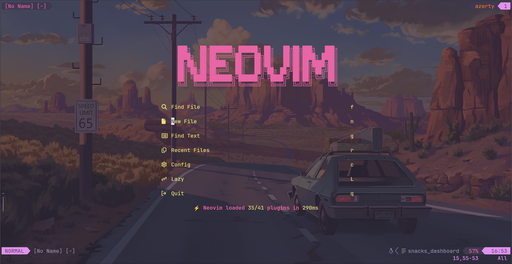
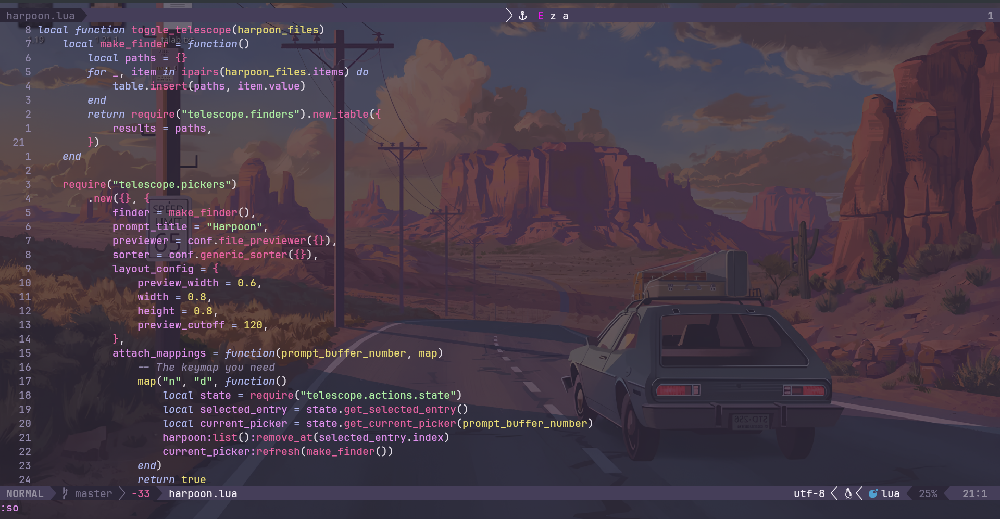

# My Neovim Configuration

## Overview
[Brief description of your Neovim setup, philosophy, and key features]

## Plugin Management
### Plugin Manager
[lazy.nvim]

## Screenshot

## Themes and Appearance
- Color Scheme: hardhacker
- Font: fira code
- Statusline/tabline: lualine

## for help
### read the cheatsheet
`help cheatsheet`

## Future Improvements
- [ ] Add more language servers
- [ ] Add more custom snippets
- [ ] highlight lsp definitions
