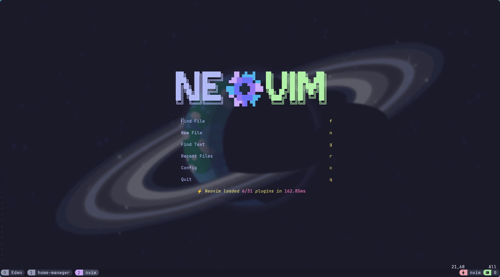
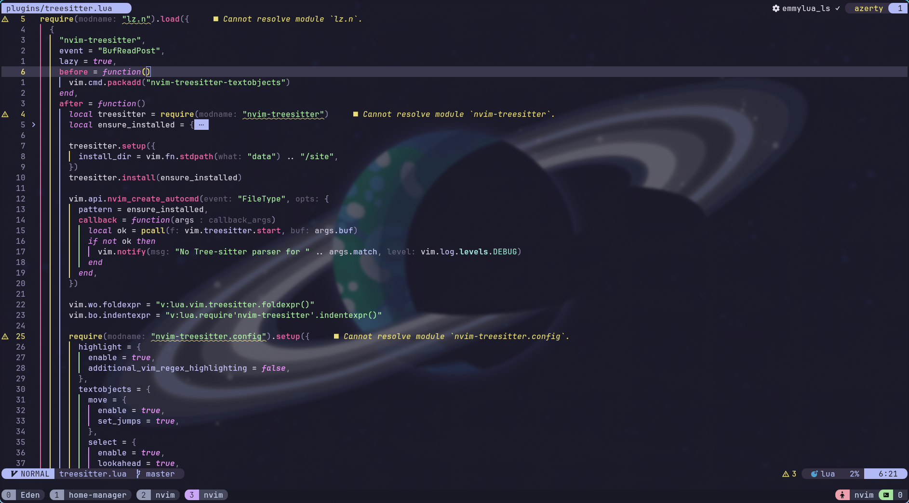

# My Neovim Configuration

## Screenshots




## Validation

All CI tools and packages are pinned by `flake.lock`.

Run the repository-source startup and syntax checks:

```sh
./scripts/check
```

Build the same Neovim and Home Manager outputs checked in CI:

```sh
nix flake check
```

Run the quality and security tools:

```sh
nix develop .#ci --command shellcheck scripts/check scripts/benchmark scripts/check-upstreams
nix develop .#ci --command deadnix --fail flake.nix home-manager.nix
nix develop .#ci --command statix check .
nix develop .#ci --command actionlint
nix develop .#ci --command zizmor --persona pedantic .github/workflows
nix develop .#ci --command gitleaks git --redact --no-banner
```

Measure startup performance against the Nix-built editor:

```sh
nvim_path="$(nix build .#neovim --no-link --print-out-paths)"
NVIM_BIN="$nvim_path/bin/nvim" ./scripts/benchmark
```

The default startup thresholds are 750 ms for a warning and 2000 ms for a failure. Override them with `NVIM_STARTUP_WARNING_MS` and `NVIM_STARTUP_FAILURE_MS` when investigating a deliberate change.

## Automation

`CI` runs on every pull request and push to `master`. It:

- evaluates and builds the complete Home Manager configuration;
- checks package metadata for packages marked broken or vulnerable by Nixpkgs;
- starts the repository configuration with the exact Nix-built Neovim wrapper;
- validates Lua syntax and the `:Cheatsheet` command;
- measures startup performance;
- runs ShellCheck, Deadnix, Statix, Actionlint, Zizmor, and Gitleaks.

`Dependency health` runs every Monday and can also be started manually. It:

- checks plugin and tool GitHub and Codeberg repositories for archived, disabled, or two-year-stale upstreams;
- updates every flake input inside the disposable runner;
- rebuilds and starts the configuration against those latest revisions;
- reports the available lock-file changes without modifying the repository.

Dependabot checks the pinned GitHub Actions weekly. Flake-input compatibility is handled by the scheduled latest-input job.
